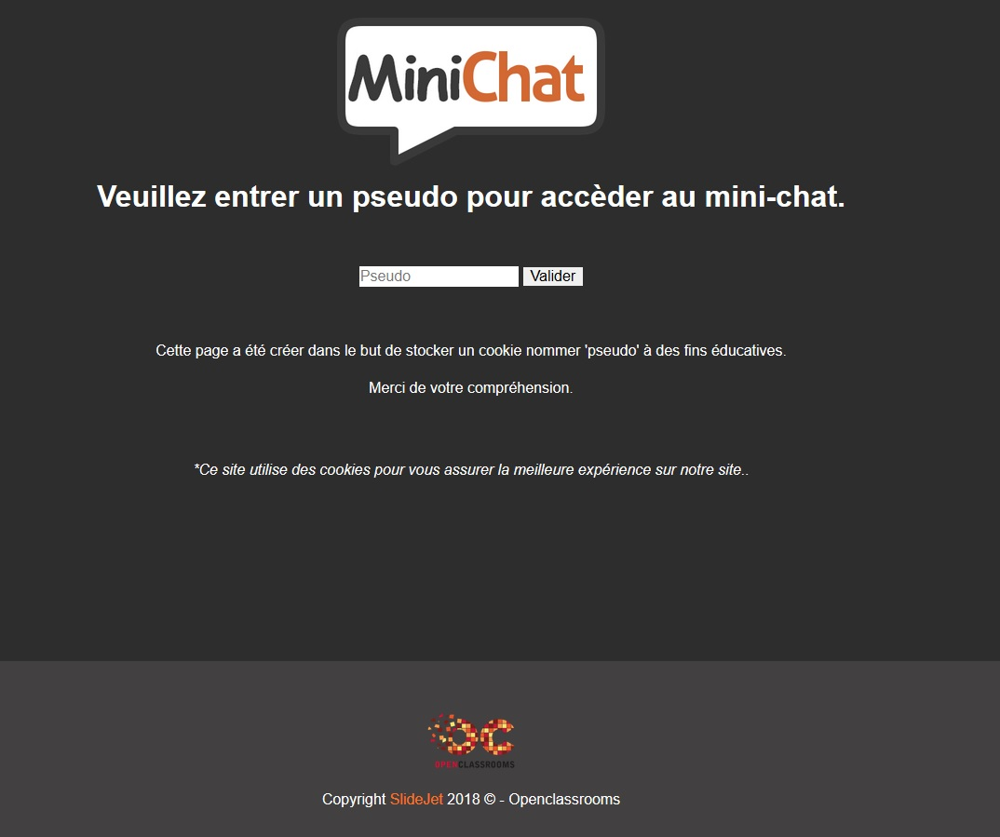

# TP-Openclassroom-MiniChat
TP OpenClassroom Mini-chat.php ( Cours : Concevez votre site web avec PHP et MySQL ).

TP qui va nous permettre de mettre en pratique tout ce que l'on vient d'apprendre sur le langage SQL et PHP.

Objectif : 

- Retenir nom d'utilisateur grâce à un cookie.
- Affichage Date de publication d'un message
- Ordonner par message récent
- Protection faille XSS.

